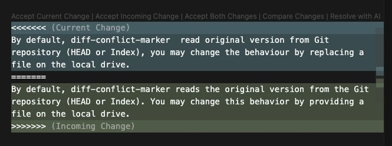

**Diff Conflict Marker** is a command-line tool that adds merge-conflict markers to a file based on the `diff` between the file and its version in the Git repository. This simplifies line-by-line inspection and review of changes.



### Background

Modern development increasingly relies on AI-assisted tools like VS Code, Cursor, and others. These tools are not limited to programming—they are also used for tasks like documentation editing. However, a common risk is that AI systems can introduce unnecessary or unintended modifications. To maintain reliability, users need a mechanism to verify AI-generated edits against the existing repository state.

Diff Conflict Marker solves this problem by generating conflict markers that compare AI-generated content with the committed version in Git. This allows users to review both versions side-by-side and decide which changes to accept.

An IDE like VS Code can read the output and display the conflict markers in a user-friendly format, allowing you to browse the changes and decide which ones to keep.
 
### Example Usage

For example, suppose you have a `README.md` file committed to Git. You have added the file to the Git repository.

```bash
git add README.md
```

You then run the following prompt in the Gemini CLI:

```
Fix the grammar mistakes in @README.md
```

The AI then applies grammar corrections. At this point, you can check the changes with `git diff`. 

Alternatively, you can run:

```bash
diff-conflict-marker README.md
```

Opening the file in VS Code (or any VS Code-powered IDE) will display the AI's edits alongside the original content, formatted as merge-conflict markers. This provides a clear, line-by-line comparison, so you can confidently choose the correct version.


### Gemini CLI

If you are using the Gemini CLI, you can combine the process above into a single custom command.

```toml
description = "Grammar Correction"

prompt = """
Act as a Senior Technical Editor. Your primary task is to review and edit a provided document for two purposes: correcting all grammatical errors and adjusting the tone to ensure it is professional, precise, and appropriate for a technical document. 

If no file content is provided, state: 'Please provide the document content to be reviewed.' 

Before editing the document, run the following command and ignore the output and error:

git add "${filename}"

After editing the document, run the following command and ignore the output and error:

diff-conflict-marker --backup "${filename}"
"""
```

# Installation

```
npm install -G diff-conflict-marker
```

# Usage

## Apply Conflict Markers

```bash
diff-conflict-marker your_file
```

## Set Original Version

```bash
diff-conflict-marker --orig README.orig.md README.md
```

By default, Diff Conflict Marker reads the original version from the Git repository (HEAD or the index). You can override this by providing a local file path.

## Backup

When `diff-conflict-marker` modifies a file, you can create a backup of the original content by using the `--backup` flag.

```bash
diff-conflict-marker --backup your_file
```

This command saves a copy of `your_file` before adding conflict markers. The backup is stored in the same directory with a `.bk` extension.

If a backup file with the same name already exists, the tool will automatically rotate the existing backups by renaming them with an incremental suffix (e.g., `.bk-001`, `.bk-002`).


# Development

To set up the development environment, clone this repository and install the dependencies:

```bash run
npm install
```

## Building the project

To build the project, run:

```bash run
npm install
npm run build
```

## Install locally

```bash run
npm install -g .
```

## Running tests

To run the tests, use the following command:

```bash run
npm test
```

## Linting

To lint the code, use:

```bash run
npm run lint
```

## Formatting

To format the code, run:

```bash
npm run format
```
